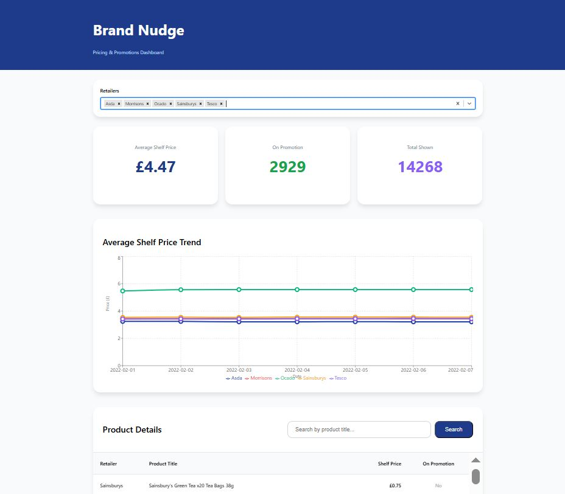

# Brand Nudge - Pricing & Promotions Dashboard
#### Ronia Palatty

### A full-stack market intelligencce dashboard for the Junior Developer Technical Exercise.

## Features include:
- **Interactive Trend Chart** – Average shelf price over time with multi-retailer comparison (colour-coded lines)
- **Multi-Select Retailer Filter** – Compare multiple retailers simultaneously
- **Product Search** – Real-time search by product title
- **KPI Cards** – Average price, promotions count, total shown
- **Optimized Table** – Scrollable with performance limits
- **Clean UI** – Inspired by Brand Nudge branding

## Tech Stack:
**Backend**
- Node.js + Express.js
- CSV parsing with 'csv-parser'

**Frontend**
- React 18 (Hooks)
- Recharts (Line Chart)
- react-select (Multi-select)

## Setup Instructions:
### Backend
- cd backend
- npm install
- node server.js

### Frontend
- cd frontend
- npm install
- npm start
